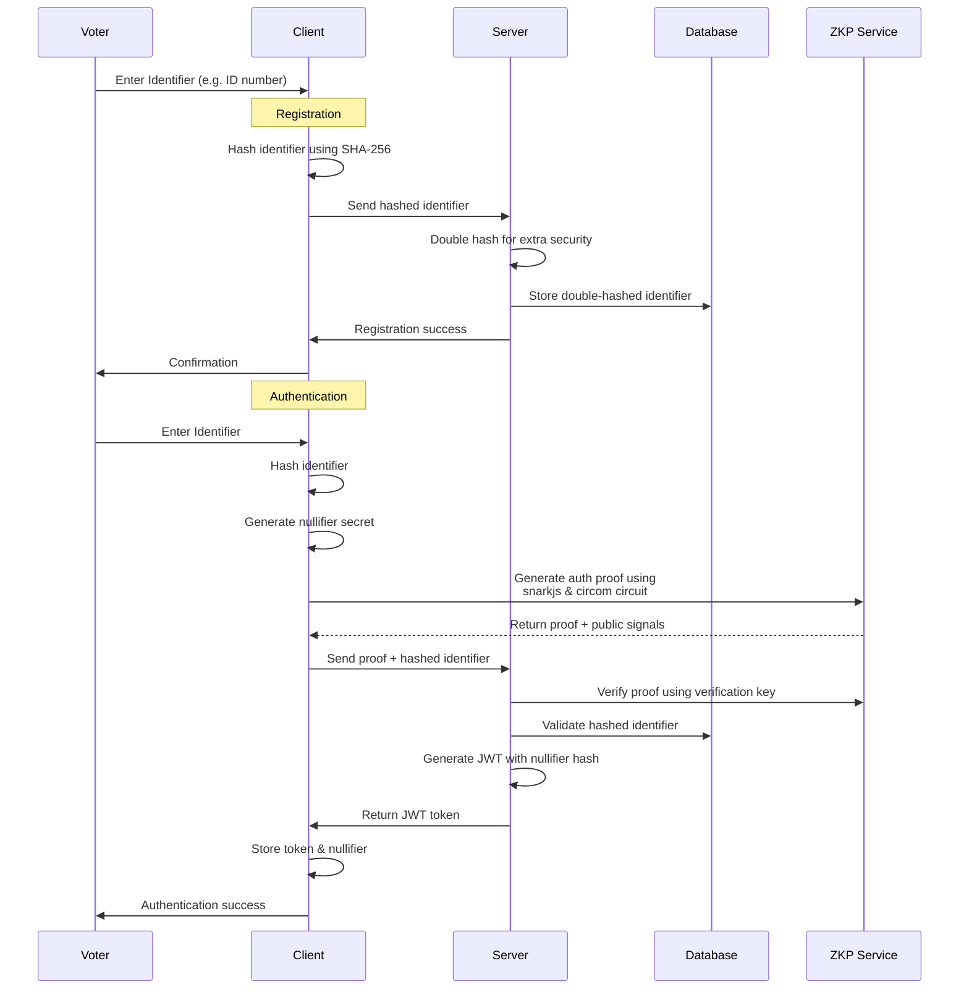
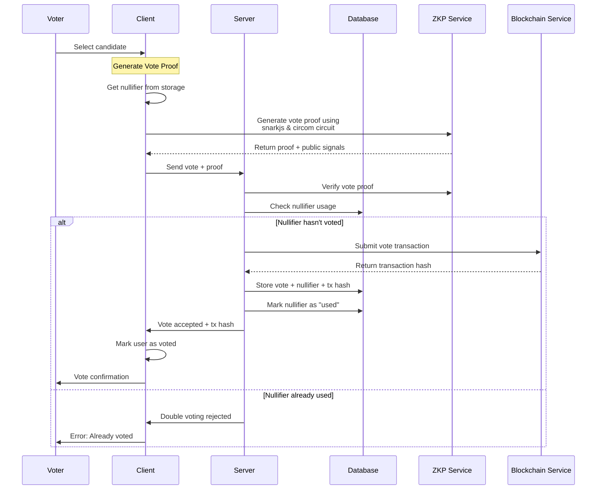
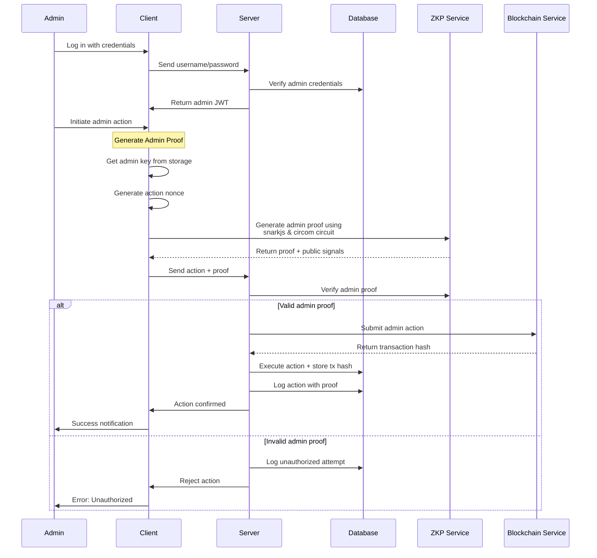
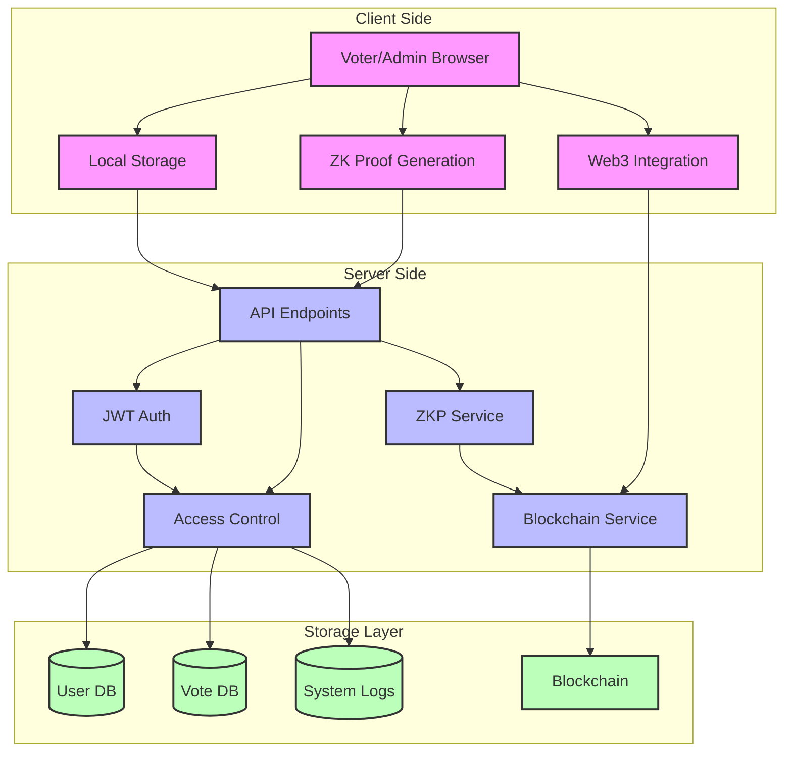

# ZK-SNARK Flow Diagrams

Below are sequence diagrams illustrating the flow of Zero-Knowledge Proofs in our voting system.

## 1. Voter Registration and Authentication Flow

## 2. Voting Process Flow

## 3. Admin Actions Flow

## 4. Complete System Architecture

These diagrams illustrate the complete flow of Zero-Knowledge Proofs in our voting system, showing how privacy is maintained throughout the process while ensuring security and preventing fraud. 