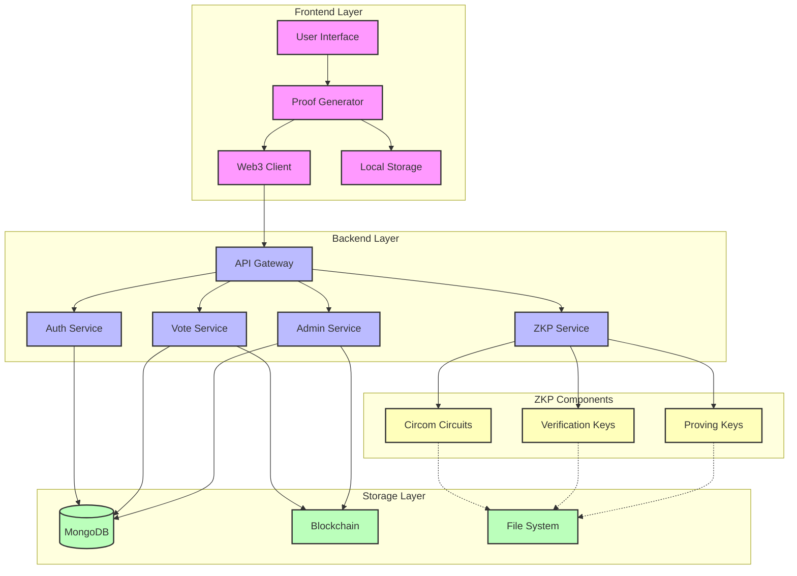
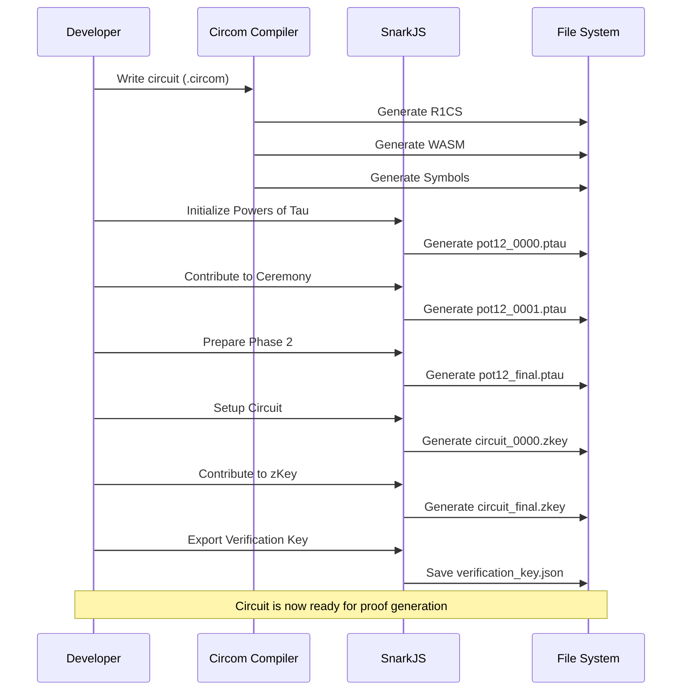
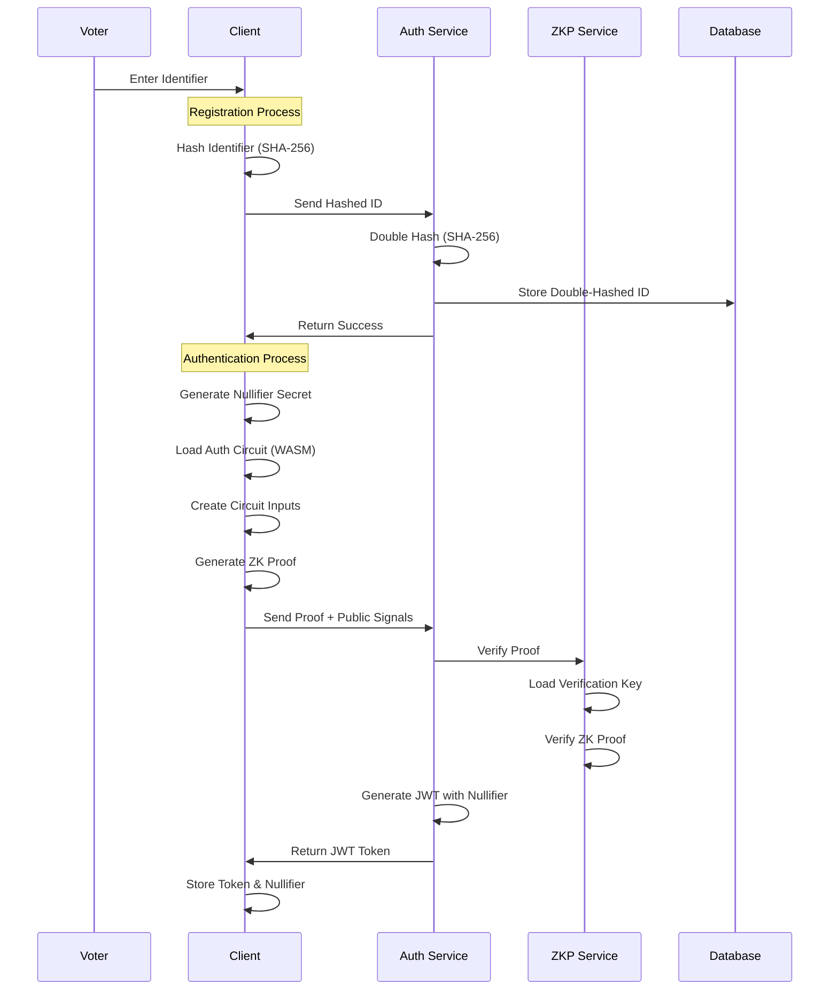
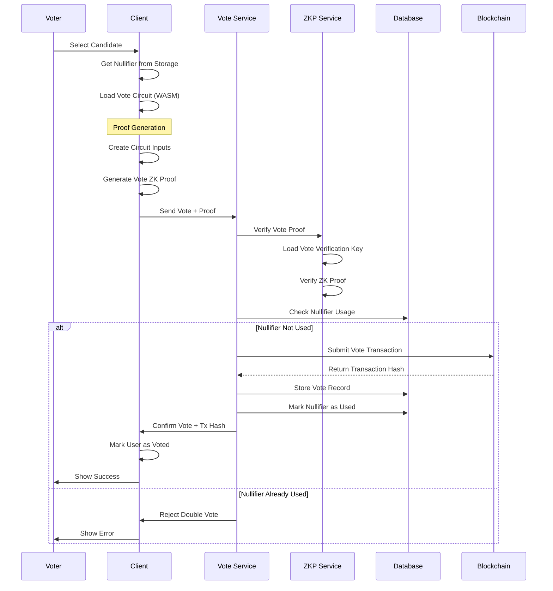
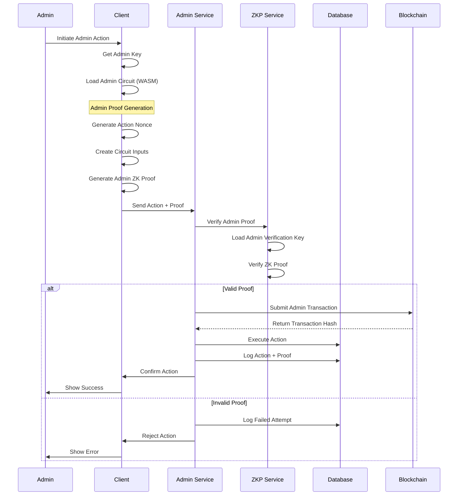
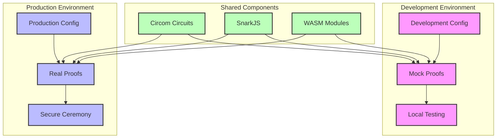
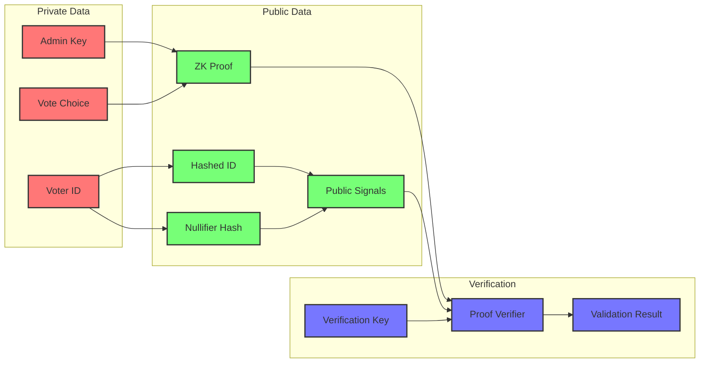

# ZKP-SNARK Implementation Workflow

## 1. System Overview

## 2. Circuit Compilation Flow

## 3. Voter Registration and Authentication

## 4. Voting Process

## 5. Admin Actions

## 6. Development vs Production Flow

## 7. Data Flow and Privacy

These diagrams provide a comprehensive view of our ZKP-SNARK implementation, showing:
1. Overall system architecture
2. Circuit compilation process
3. Voter registration and authentication flow
4. Voting process with proof generation and verification
5. Admin actions with secure proof verification
6. Development vs Production environments
7. Data flow and privacy preservation

Each component is color-coded for better understanding:
- Frontend components: Pink
- Backend components: Light blue
- Storage components: Light green
- ZKP components: Light yellow
- Private data: Red
- Public data: Green
- Verification components: Blue 